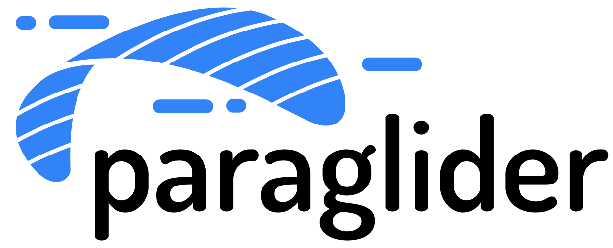

# Paraglider

Paraglider is a cross-cloud control plane for configuring networking. 

## Current status

Paraglider is in the prototype phase, and we're currently building it with a small cross-industry team.

## Contributing

See the [contributing guide](https://paragliderproject.io/developers/contributing) for ways to contribute and instructions.

## Code of Conduct

This project has adopted the code of conduct defined by the Contributor Covenant to clarify expected behavior in our community.
For more information, see the [Contributor Covenant Code of Conduct 2.1](https://www.contributor-covenant.org/version/2/1/code_of_conduct/).

## Technical Charter

See the [technical charter](./technical-charter.pdf) for the governance structure of the project.
