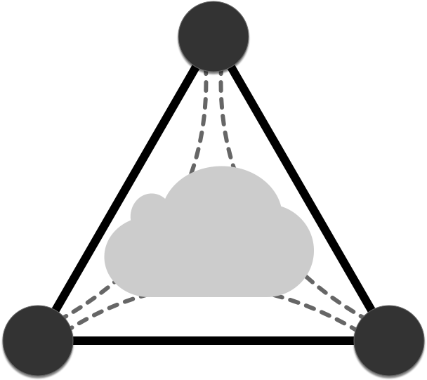

# Invisinets API


## Namespace Operations
Changes or gets the active namespace on the Invisinets Controller.

### Set

**CLI:**
`inv namespace set <namespace>`

Parameters:
* `namespace`: namespace to set on the controller

**HTTP:**
`POST /namespace/<namespace>/`

Parameters:
* `namespace`: namespace to set on the controller

### Get 

**CLI:**
`inv namespace get`

**HTTP:**
`GET /namespace/`


## Resource Operations

### Create

Creates a resource according to the description provided in the speciied cloud. Some clouds may require a URI before resource creation and others may leave this field blank. Note that a tag is automatically created for the resource with the name `<namespace>.<cloud>.<vm_name>` (where `vm_name` is pulled from the name field in the resource description).

**CLI:**
`inv resource create <cloud> <uri> <path_to_json>`

Parameters:
* `cloud`: name of the cloud to create the resource in
* `uri` : URI of the resource to create (required by Azure for metadata, can be left blank for GCP)
* `path_to_json`: path to JSON file describing the resource to be created (excluding networking details)

**REST:** 
`POST /cloud/<cloud>/resources/` 

* Example JSON:

    ```
    {
    "id": "resource/uri",
    "description": "{
                    "location": "eastus",
                    "properties": {
                        "hardwareProfile": {
                            "vmSize": "Standard_B1s"
                        },
                        "osProfile": {
                            "adminPassword": "",
                            "adminUsername": "",
                            "computerName": "sample-compute"
                        },
                        "storageProfile": {
                            "imageReference": {
                                "offer": "debian-10",
                                "publisher": "Debian",
                                "sku": "10",
                                "version": "latest"
                            }
                        }
                    }
                }"
    }
    ```

Parameters:
* `cloud`: name of the cloud to create the resource in
* `id` : URI of the resource to create (required by Azure for metadata, can be left blank for GCP)
* `description`: JSON string describing the resource to be created (excluding networking details)


## Permit List Operations
These operations interact with the permit list associated with a given resource by adding/deleting/getting rules.

### Get

Gets the rules associated with a resource.

**CLI:**
`inv rule get <cloud> <uri>`

Parameters:
* `cloud`: name of the cloud that the resource is in
* `uri`: URI of the resource

**REST:**
`GET /cloud/<cloud>/permit-list/<uri>` 

Parameters:
* `cloud`: name of the cloud that the resource is in
* `uri`: URI of the resource

### Add 

Adds one or many rules to the permit list associated with a resource.

**CLI:** 
`inv rule add <cloud> <uri> [--ssh <tag> --ping <tag> | --ruleFile <path_to_file>]`

Parameters:
* `cloud`: name of the cloud that the resource is in
* `uri`: URI of the resource
* `path_to_file`: path to JSON file describing rules to add
* `tag`: Invisinets tag or IP to allow SSH/ICMP traffic to/from

**REST:**
`POST /cloud/:cloud/permit-list/rules/` 

* Example JSON:

    ```
    {
    "associated_resource": "uri",
    "rules": [
        {
            "id" : "id",
            "tags": ["tagname"],
            "direction": 0,
            "src_port": 1,
            "dst_port": 2,
            "protocol": 3
        }
    ]
    }
    ```

Parameters:
* `cloud`: name of the cloud that the resource is in
* `uri`: URI of the resource
* `rules`: list of rules to add to the permit list

### Delete

Deletes one or many rules from the permit list associated with the specified resource.

**CLI:** 
`inv rule delete <cloud> <uri> [--ssh <tag>] [--ip <tag>] [--ruleFile <path_to_file>]`

Parameters:
* `cloud`: name of the cloud that the resource is in
* `uri`: URI of the resource
* `path_to_file`: path to JSON file describing rules to add
* `tag`: Invisinets tag or IP to allow SSH/ICMP traffic to/from

**REST:**
`DELETE /cloud/:cloud/permit-list/rules/` 

    ```
    {
    "associated_resource": "uri",
    "rules": [
        {
            "id" : "id",
            "tags": ["tagname"],
            "direction": 0,
            "src_port": 1,
            "dst_port": 2,
            "protocol": 3
        }
    ]
    }
    ```

Parameters:
* `cloud`: name of the cloud that the resource is in
* `uri`: URI of the resource
* `rules`: list of rules to add to the permit list

## Tag Operations
Operations on Invisinets tags.

### Get

Gets the children tags associated with a tag or resolves the tag down to last-level entries (IPs).

**CLI:**
`inv tag get <tag> [--resolve]`

Parameters:
* `tag`: tag to get
* `resolve`: true/false value indicating whether to resolve to last-level tags or not

**REST:** 
`GET /tags/<tag>/` or `GET /tags/<tag>/resolve`

Parameters:
* `tag`: tag to get

### Set

Adds children tags to a parent tag or creates a last-level tag that associates a names with an URI and/or IP.

**CLI:** 
`inv tag set <tag> [--children <child_tag_list>] | [--uri <uri>] [--ip <ip>]`

Parameters:
* `tag`: tag to set
* `children`: list of tags to add as children
* `uri`: uri to associate with tag
* `ip`: ip to associate with tag

**REST:**
`POST /tags/<tag>/`

    ```
    {
    "tag_name": "tag",
    "uri": "uri",
    "ip": "1.1.1.1"
    }
    ```

Parameters:
* `tag`: tag to set
* `children`: list of tags to add as children
* `uri`: uri to associate with tag
* `ip`: ip to associate with tag

### Delete

Deletes a tag or the association of members tags to that tag.

**CLI:**
`inv tag delete <tag> [--members <members_list>]`

Parameters:
* `tag`: tag to delete
* `members`: list of child tags to remove membership

**REST:**
`DELETE /tags/<tag>/` (no json) or `DELETE /tags/<tag>/members`

    ```
    {
    [
        "child1"
    ]
    }
    ```

Parameters:
* `tag`: tag to delete
* `members`: list of child tags to remove membership
