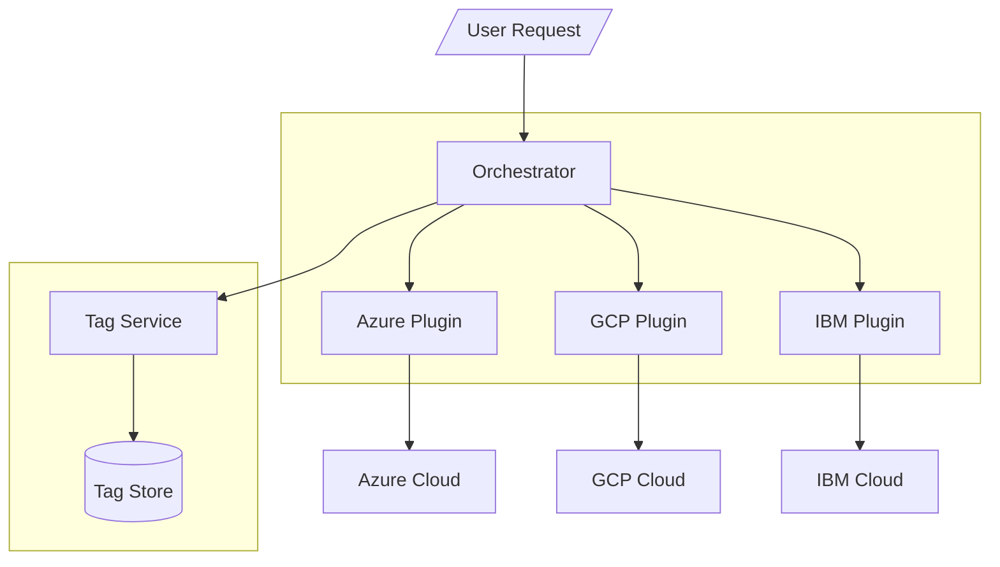

# Invisinets Design

## What is Invisinets?
Invisinets is a control plane for cloud networking resources designed to simplify the tenant networking experience. The Invisinets Controller exposes the Invisinets API to tenants and uses public cloud APIs to manage the tenant's cloud network.

### Conceptual Overview
Invisinets takes an "endpoint-centric" view of networking: all non-networking resources should simply define their high-level networking intents and the rest should be deployed automatically -- making the network *invisible*.

#### Core Concepts
* **Endpoint**: Any resource in a cloud network (eg, a VM)
* **Permit List**: A list associated with an endpoint which defines the allowed traffic for that endpoint
* **Tags**: Strings associated with an endpoint or group of endpoint which can be referred to in permit lists and commands
* **Namespaces**: An Invisinets deployment controlled by an Invisinets controller separated (both in infrastructure and in control plane) from other namespaces under the same controller

### Use
To use Invisinets, a tenant would run the Invisinets Controller and use the Invisinets API to create cloud deployments. This task largely consists of creating endpoints and modifying their permit lists to enable connectivity between them.

## How Invisinets Works
The Invisinets Controller uses public cloud APIs to deploy networking resources (eg, VPCs, subnets, security rules, VPN gateways) as necessary to match the high-level intents specified via the Invisinets API. [MORE?]

### Controller Design

#### Overview
The Invisinets Controller consists of several microservices: a Central Controller, a Tag Service, and potentially multiple Cloud Plugins. Each service is described below.

#### Central Controller
The Central Controller accepts user requests and sends requests to the other microservices to complete these tasks. It is the central point of coordination for multi-service tasks.

#### Tag Service
The Tag Service is a light-weight service on top of a key-value store which stores data about the mappings between tags and the resources that reference them ("subscribers"). Subscribers must be tracked in order to push updates to permit lists when tag membership changes.

#### Cloud Plugins
Cloud Plugins implement the Invisinets Cloud Plugin Interface for their respective cloud. For more about the Invisinets Cloud Plugin Interface, see [link to implementation doc]
