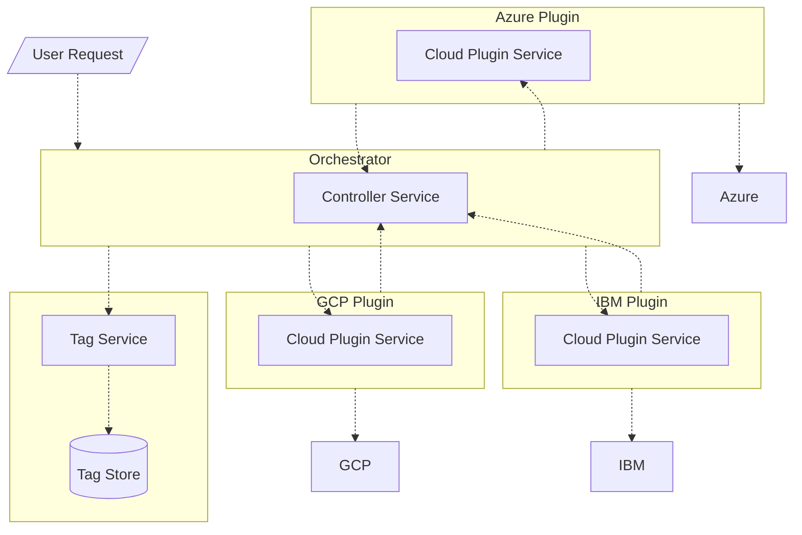

# Controller Implementation
This doc covers the internal interfaces between each service in the controller. All of the components communicate via gRPC.




Each service implements a gRPC service interface and may be a client to other servers in the overall controller. In the diagram, each box contains the gRPC service implemented by that service and has arrows to each service it is a client of. For example, the Orchestrator implements the Controller Service, which each cloud plugin uses, and it is a client of each of the plugin services as well as the tag service.

Below, we provide references to the interfaces of each service and brief explanations of each RPC.

## Orchestrator
The Orchestrator has a few main jobs:
* Accept user requests and send RPCs to the necessary cloud plugins/tag service.
* Orchestrate multi-cloud operations such as VPN tunnel setup.
* Resolve references to tags before handing requests to the cloud plugin.
* Orchestrate the update of permit lists when tag membership changes.
* Give out address spaces to the cloud deployments to avoid overlaps.

### Controller Interface
The `Controller` interface can be found in `pkg/invisinetspb/invisinets.proto`. 

```
service Controller {
    rpc FindUnusedAddressSpace(Namespace) returns (AddressSpace) {}
    rpc GetUsedAddressSpaces(Namespace) returns (AddressSpaceMappingList) {}
    rpc ConnectClouds(ConnectCloudsRequest) returns (BasicResponse) {}
}
```

**rpc FindUnusedAddressSpace(Namespace) returns (AddressSpace) {}**
Returns an address space that is currently not used in any cloud in the Invisinets namespace.

**rpc GetUsedAddressSpaces(Namespace) returns (AddressSpaceMappingList) {}**
Returns a list of address spaces currently used in the namespace. The address spaces are mapped to their respective cloud.

**rpc ConnectClouds(ConnectCloudsRequest) returns (BasicResponse) {}**
Initiates a request to the orchestrator to orchestrate the connection of two clouds via VPN.

## Cloud Plugins
The `CloudPlugin` interface can be found in `pkg/invisinetspb/invisinets.proto`.

```
service CloudPlugin {
    rpc GetUsedAddressSpaces(InvisinetsDeployment) returns (AddressSpaceList) {}
    rpc CreateResource(ResourceDescription) returns (CreateResourceResponse) {}
    rpc GetPermitList(ResourceID) returns (PermitList) {}
    rpc AddPermitListRules(PermitList) returns (BasicResponse) {}
    rpc DeletePermitListRules(PermitList) returns (BasicResponse) {}
    rpc CreateVpnGateway(InvisinetsDeployment) returns (CreateVpnGatewayResponse) {}
    rpc CreateVpnBgpSessions(CreateVpnBgpSessionsRequest) returns (CreateVpnBgpSessionsResponse) {}
    rpc CreateVpnConnections(CreateVpnConnectionsRequest) returns (BasicResponse) {}
}
```

**rpc GetUsedAddressSpaces(InvisinetsDeployment) returns (AddressSpaceList) {}**
Find all the address spaces currently used by the Invisinets deployment in a given cloud and namespace.

Input Details:
* The `InvisinetsDeployment` contains the URI/ID necessary to find the Invisinets networks (eg, subscription + resource in Azure or project in GCP) as well as the namespace to collect addresses from

Resources to Create:
* None

High-Level Logic:
* Get address spaces of all vnets/subnets/vpcs created by invisinets so far in the given namespace


**rpc CreateResource(ResourceDescription) returns (CreateResourceResponse) {}**
Creates the provided resource in the designated Invisinets virtual network so that it can be easily connected to other Invisinets resources.

Input Details:
* The description in the resource description should specify **all but** the networking details of the resource.
* The request contains a namespace in which the resource should be created

Resources to Create:
* The provided resource
* A permit list for the resource (implementation varies by cloud) with all traffic denied by default
* A virtual network in the region and namespace of the resource if it does not yet exist

High-Level Logic:
* Check if there exists an Invisinets virtual network in the region and namespace of the new resource
* If there is not, create one
    * Note: to get the address space for the new region and ensure that it does not overlap with others controlled by the controller, you must call `FindUnusedAddressSpace` at the orchestrator server, which will call `GetUsedAddressSpaces` on all registered clouds
    * If the vpc/subnet are provided, the rpc should return an error
* Create the resource, ensuring it is in the Invisinets virtual network for the region and namespace
* Create the permit list for the resource with all traffic denied by default

**rpc GetPermitList(ResourceID) returns (PermitList) {}**
Gets the underlying security rules for the resource and returns them as permit list objects.

Input Details:
* ResourceID contains the URI of the resource to get the permit list from

Resources to Create:
* None

High-Level Logic:
* Check if the resource is a valid Invisinets resource and whether it is within the namespace provided
    * If the resource is not in the provided namespace, raise an error
* Get the security rules associated with the resource
* Return as PermitList rules


**rpc AddPermitListRules(PermitList) returns (BasicResponse) {}**
Add the provided rules to the underlying security rules for the resource and setup any necessary infrastructure for the connections.

Input Details:
* The `targets` field in a rule is the resolved IP addresses/prefixes to use as the source/destination.
* The `tags` field in a rule is the original tags specified by the user. These should be stored in some rule metadata for reverse mappings.
* The `protocol` field in a rule is an `int` determined by the [IANA standard](https://www.iana.org/assignments/protocol-numbers/protocol-numbers.xhtml)
* The source/destination in a rule in the underlying cloud abstraction should be inferred based on the direction (ie, if it is `INBOUND`, then the destination is the IP of the resource the rule is being applied to and the source is the provided tag).

Resources to Create:
* Per-endpoint access control list rules (implementation varies by cloud [NSG in Azure, Firewall Rules in GCP])

High-Level Logic:
* Check if the resource/rules are valid
    * If the resource is not in the provided namespace, raise an error
* If the given resource and the remote endpoint are in the same virtual network:
    * Update the security rules to allow the traffic (avoiding duplicate rules)
* If the given resource and the remote endpoint are in the same cloud but different virtual networks:
    * Update the security rules to allow the traffic (avoiding duplicate rules)
    * Create the necessary connection infrastructure between the two virtual networks (ex. Vnet peering in Azure)
* If the given resource and the remote endpoint are not in the same cloud:
    * Update the security rules to allow the traffic (avoiding duplicate rules)
    * Create the necessary connection infrastructure to connection across clouds using the VPN RPCs on the orchestrator


**rpc DeletePermitListRules(PermitList) returns (BasicResponse) {}**
Delete the provided rules from the underlying security rules for the resource.

NOTE: Eventually, there should be additional logic to remove infrastructure if no rules are using it. We do not support this currently.

Input Details:
* The `targets` field in a rule is the resolved IP addresses/prefixes to use as the source/destination.
* The `tags` field in a rule is the original tags specified by the user. These should be stored in some rule metadata for reverse mappings.
* The `protocol` field in a rule is an `int` determined by the [IANA standard](https://www.iana.org/assignments/protocol-numbers/protocol-numbers.xhtml)
* The source/destination in a rule in the underlying cloud abstraction should be inferred based on the direction (ie, if it is `INBOUND`, then the destination is the IP of the resource the rule is being applied to and the source is the provided tag).

Resources to Delete:
* Per-endpoint access control list rules (implementation varies by cloud [NSG in Azure, Firewall Rules in GCP])

High-Level Logic:
* Check if the resource/rules are valid
* Delete the rules from the resource.

**rpc CreateVpnGateway(InvisinetsDeployment) returns (CreateVpnGatewayResponse) {}**
Creates a VPN gateway in a given cloud.

Resources to Create:
VPN gateway

High-Level Logic:
* Create VPN gateway along with (manually) setting up public IP addresses for the gateway tunnels

Input Details:
* The URI/ID necessary to find the Invisinets networks (eg, subscription + resource in Azure or project in GCP)


**rpc CreateVpnConnections(CreateVpnConnectionsRequest) returns (BasicResponse) {}**
Creates a VPN connection between two clouds.

Resources to Create:
* VPN connection
* Local network gateway

High-Level Logic:
* Create VPN connections and local net

Input Details:
* The URI/ID necessary to find the Invisinets networks (eg, subscription + resource in Azure or project in GCP)
* The remote cloud to make the connection to as well as its ASN, gateways IP, BGP IP addresses, and a shared key for the tunnel


## Tag Service
The `TagService` interface can be found in `pkg/tag_service/tagservicepb/tagservice.proto`. 

```
service TagService {
    rpc SetTag(TagMapping) returns (BasicResponse) {}
    rpc GetTag(Tag) returns (TagMapping) {}
    rpc ResolveTag(Tag) returns (TagMappingList) {}
    rpc DeleteTagMember(TagMapping) returns (BasicResponse) {}
    rpc DeleteTag(Tag) returns (BasicResponse) {}
    rpc Subscribe(Subscription) returns (BasicResponse) {}
    rpc Unsubscribe(Subscription) returns (BasicResponse) {}
    rpc GetSubscribers(Tag) returns (SubscriberList) {}
}
```

**rpc SetTag(TagMapping) returns (BasicResponse) {}**
Sets tag value in the KV store.

Input Details:
* `TagMapping` should include *either* the URI and/or IP of the tag *or* the members of the tag. These types of values are stored differently in the KV store.

**rpc GetTag(Tag) returns (TagMapping) {}**
Returns the URI and IP associated with the tag if it is a leaf or the members if it is not.

**rpc ResolveTag(Tag) returns (TagMappingList) {}**
Resolves a tag down to the URIs and IPs associated with it, traversing the tree of tags to get to leaves.

**rpc DeleteTagMember(TagMapping) returns (BasicResponse) {}**
Deletes a member from a non-leaf tag.

**rpc DeleteTag(Tag) returns (BasicResponse) {}**
Deletes a tag and all associations with it.

**rpc Subscribe(Subscription) returns (BasicResponse) {}**
Records a URI as a subscriber to a tag to be used to track membership changes.

**rpc Unsubscribe(Subscription) returns (BasicResponse) {}**
Unsubscribes a resource from a tag.

**rpc GetSubscribers(Tag) returns (SubscriberList) {}**
Gets all subscribers associated with a tag.
